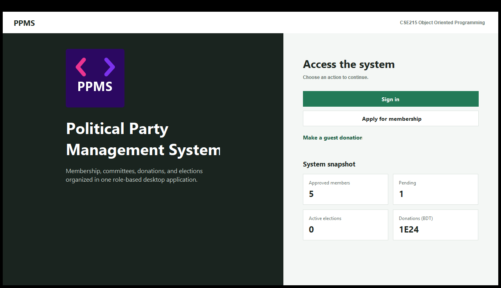
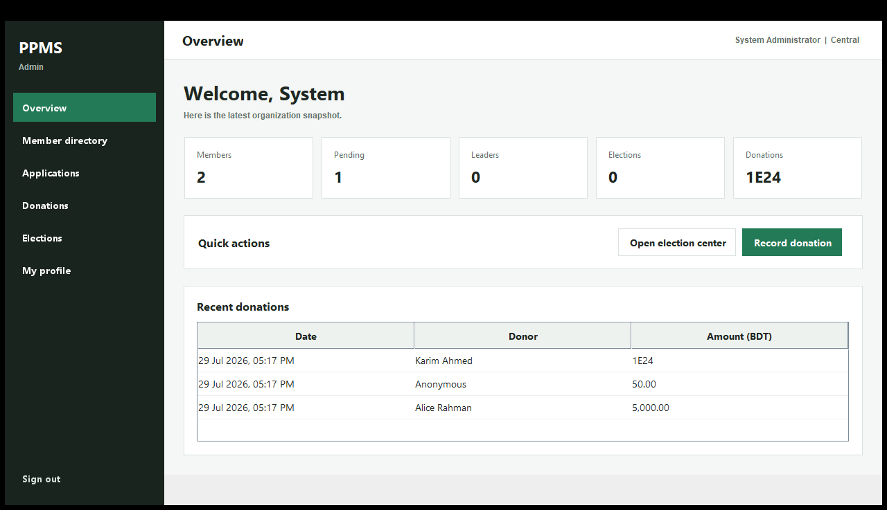
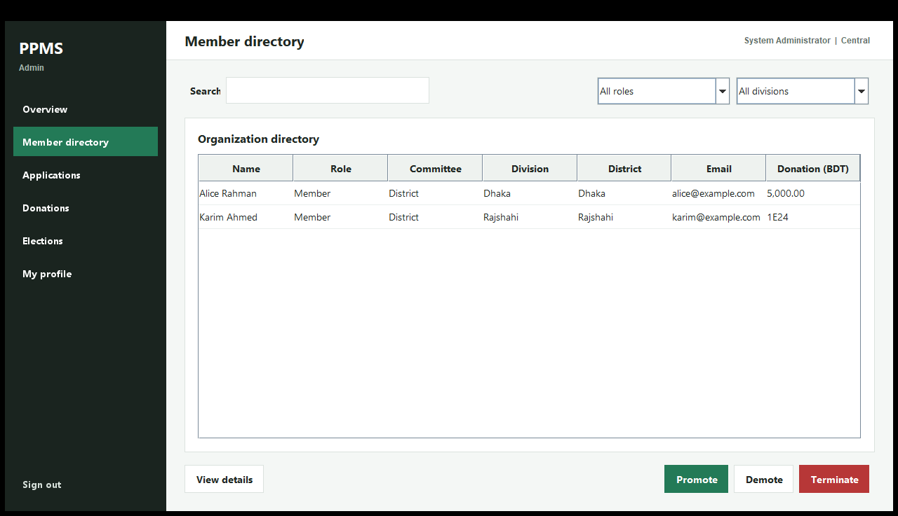

# Political Party Management System

A Java 21 desktop application for managing political-party membership, committee
leadership, donations, and elections. The project was developed for CSE215
(Object Oriented Programming) and uses only the Java standard library and Swing.

[Download the runnable JAR](release/Political-Party-Management-System.jar)



## Highlights

- Dynamic, role-based Swing workspace for administrators, leaders, and members
- Membership application form with live division-to-district selection and validation
- Searchable member directory with role and division filters
- Application review queue with approve and reject actions
- Central, divisional, and district committee hierarchy
- Election declaration, candidate registration, voting, counting, and winner assignment
- Member and guest donations with a persistent donation ledger
- Live dashboard metrics for members, applications, leaders, elections, and donations
- Editable member profile with duplicate-email and password validation
- CSV and text-file persistence with no database or third-party dependency
- Java service tests and a 10-view Swing rendering smoke test

## Screenshots

### Administrator dashboard



### Searchable member directory



## Role Access

| Capability | Member | Leader | Administrator |
| --- | :---: | :---: | :---: |
| View dashboard and directory | Yes | Yes | Yes |
| Update own profile | Yes | Yes | Yes |
| Donate and view donation history | Yes | Yes | Yes |
| Register as an election candidate | Yes | Yes | No |
| Vote in an active election | Yes | Yes | Yes |
| Review membership applications | No | Yes | Yes |
| Declare or close elections | No | President | Yes |
| Promote, demote, or terminate members | No | Central President | Yes |

## Demo Administrator

```text
Email: admin@party.org
Password: admin123
```

This account is created in memory by `PartySystem` and is not written to the
member CSV file.

## CSE215 Concepts

The codebase demonstrates the main object-oriented topics covered by CSE215:

- **Encapsulation:** Member and committee state is accessed through methods.
- **Abstraction:** `Committee` defines shared behavior for every committee type.
- **Inheritance:** Central, divisional, and district committees extend `Committee`.
- **Polymorphism:** Election and service operations accept the abstract committee type.
- **Interfaces:** `CommitteeOperations` defines the leadership-management contract.
- **Composition:** `PartySystem` owns committees, elections, members, and records.
- **Enums:** Roles, committee levels, divisions, and districts are type-safe.
- **Collections:** Lists, sets, maps, and enum maps model the organization.
- **Exception handling:** Domain-specific exceptions validate duplicates and donations.
- **File I/O:** Member, application, donation, and ledger data persists between runs.
- **Event-driven UI:** Swing listeners update tables, cards, filters, and navigation.

## Architecture

```text
Swing UI (ui)
    |
    v
Application services (service)
    |
    +---- Election rules and voting state
    |
    v
Domain model (model, committees, exceptions)
    |
    v
CSV and text persistence (data)
```

`MainGUI` only coordinates views and user actions. `PartySystem` owns the business
workflow, while the model and committee packages represent the domain.

## Project Structure

```text
src/
  committees/   Committee hierarchy and operations
  exceptions/   Domain-specific checked exceptions
  model/        Members, addresses, enums, and donation records
  service/      PartySystem facade, election engine, and statistics
  ui/           Java Swing application
test/
  service/      End-to-end service assertions
  ui/           Swing rendering and responsive-layout smoke test
data/           Persistent CSV and text records
docs/           README screenshots
```

## Requirements

- JDK 21 or newer
- Windows, macOS, or Linux with a graphical desktop
- No Maven, Gradle, database, or external library is required

## Compile and Run

Run these commands from the repository root in PowerShell:

```powershell
New-Item -ItemType Directory -Force out | Out-Null
$sources = Get-ChildItem src -Recurse -Filter *.java |
    ForEach-Object { $_.FullName }
javac -d out $sources
java -cp out ui.MainGUI
```

The project can also be imported directly into Eclipse:

1. Select **File > Import > Existing Projects into Workspace**.
2. Choose this repository folder.
3. Run `src/ui/MainGUI.java` as a Java Application.

## Run Tests

```powershell
$sources = Get-ChildItem src -Recurse -Filter *.java |
    ForEach-Object { $_.FullName }
$tests = Get-ChildItem test -Recurse -Filter *.java |
    ForEach-Object { $_.FullName }
javac -Xlint:all -d out $sources $tests
java -ea -cp out service.PartySystemTest
java -ea -cp out ui.MainGUISmokeTest
```

Expected results:

```text
PartySystemTest passed: 33 assertions
MainGUISmokeTest passed: 10 nonblank views rendered
```

The UI smoke test creates synthetic sample data in a temporary folder, renders every view,
checks that each image is nonblank, and never modifies repository data.

## Build a Runnable JAR

```powershell
$sources = Get-ChildItem src -Recurse -Filter *.java |
    ForEach-Object { $_.FullName }
javac -d out $sources
New-Item -ItemType Directory -Force dist | Out-Null
jar --create --file dist/Political-Party-Management-System.jar `
    --main-class ui.MainGUI -C out .
java -jar dist/Political-Party-Management-System.jar
```

Verify the packaged application without opening a window:

```powershell
java -jar dist/Political-Party-Management-System.jar --version
```

## Data Persistence

The application reads and writes these files relative to the repository root:

| File | Purpose |
| --- | --- |
| `data/data_members.csv` | Approved members and leaders |
| `data/data_pending.csv` | Pending membership applications |
| `data/data_donations.txt` | Organization donation total |
| `data/data_donations_history.csv` | Timestamped donation ledger |

Changes are saved after important actions and again when the application exits.
Run the JAR from a directory containing the `data` folder to use the included
sample records.

## Academic Scope

This is a course project, not a production political or financial system.
Passwords are stored as plain text in CSV files to keep file I/O visible for the
course requirements. A production version should use password hashing, a
database, transaction handling, authorization checks in the service layer, and
audit logging.

## Git Milestones

- `0e8ec34` - strengthened services, persistence, statistics, and tests
- `fcbb112` - delivered the dynamic role-based Swing workspace
- Final documentation and release packaging are included in the latest commit
